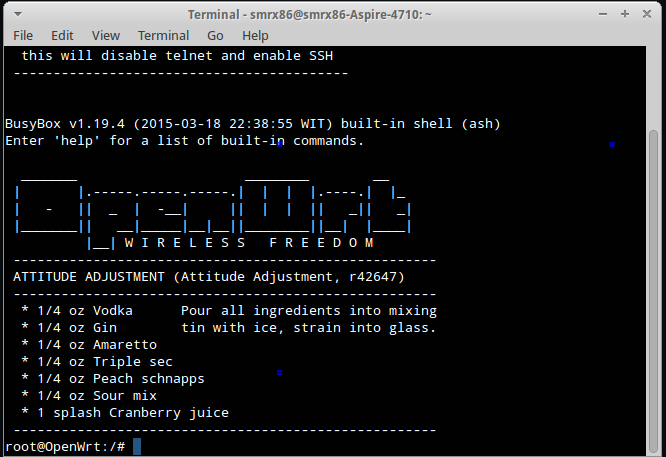
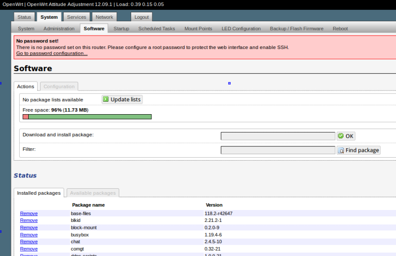

Openwrt on GL-inet
==================
[smrx86][] project, march 2015

This repository is a place (for me) to post all project reffering GL-inet router.
Everybody is free to use and modified it to make their own custom firmware.

How to use this repository
--------------------------
They are some directory in this repo, but the firmware itself will take place in the front.

* **Buildroot**, is a directory that contain builroot/build system. this buildrot is already patch with 16 MiB support build f/w.

* **Image**, this contain image file for documentation purpose.

* **Patches**, some patches and fixes file for GL-inet development i'll put it here. 

Firmware
--------
* **Instacampro**
  This firmware is a porting from my previous [instacampro][] builds. It have many package install on it like mjpeg-streamer, modswitch for 3g modem support, DDNS and Extroot packages.
  The main idea is origanally comes from [minikrebs][] project.
  preview:

  

  

  

 
[smrx86]: https://twitter.com/smrx86
[instacampro]: http://semaraks.blogspot.com/2013/08/instacampro-tl-mr3020-with.html
[minikrebs]: http://shackspace.de/wiki/doku.php?id=project:minikrebs
